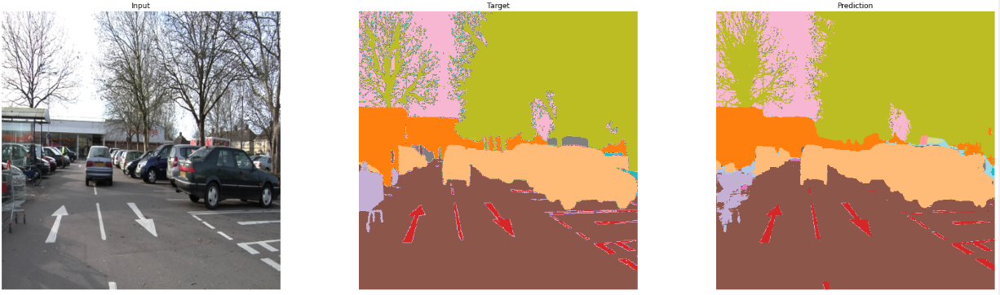
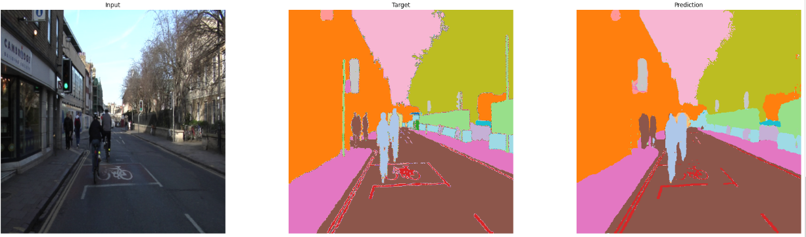
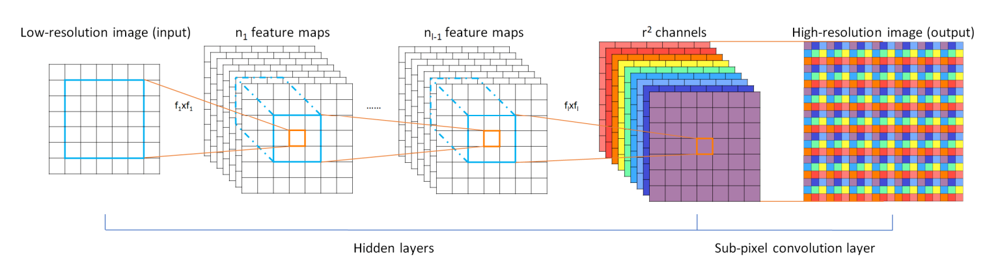

# Image Segmentation using UNet on Camvid dataset
[Colab Notebook](https://colab.research.google.com/github/prajwal-suresh13/camvid_segmentation/blob/master/segmentation.ipynb)

## Introduction
Image Segmentation is a method of dividing an image into subgroups. Each pixel of an image is assigned to a particular class. It has many applications in medical imaging,
self-driving cars etc

## Training and Results
UNet model is trained for 90 epochs. At the end of training, the training accuracy is 90.19% adn validation accuracy is 87.23%

The results are as follows:

## Data

CamVid dataset is used for training UNet model. The Cambridge-driving Labeled Video Database (CamVid) is collection of videos with object class semantic labels. 
It consists of over 700 per-pixel semantic segmentation images. Each pixel is associated to one of the 32 classes 

## Model Architecture & Loss Function

UNet is a U-Shaped encoder-decoder architecture. It consists of four enocder and four decoder blocks. Skip connections are added from encoder to decoder which helps to generate better semantic features. Cross Entropy Loss function is used

### Modifications

Padding is used inorder to get same dimension output as input 

Instead of ConvTranspose, PixelShuffle ICNR is used. PixelShuffle ICNR layers help to overcom checkerboard artifacts and provide better results. 

PixelShuffle ICNR has two layers:
1. 3x3 conv with r2 times more channels. Here r stands for factor by which image is upscaled. One of the r2 channel is randomly initialized and copied over to other r2 channels. That way, initially each of 3x3 will be same. This is called ICNR
2. nn.PixelShuffle(r)

## References
1. [UNet paper](https://arxiv.org/abs/1505.04597)
2. [PixelShuffle paper](https://arxiv.org/abs/1609.05158)
3. [ICNR](https://www.researchgate.net/publication/318337423_Checkerboard_artifact_free_sub-pixel_convolution_A_note_on_sub-pixel_convolution_resize_convolution_and_convolution_resize)
4. [fast.ai](https://course.fast.ai/)
