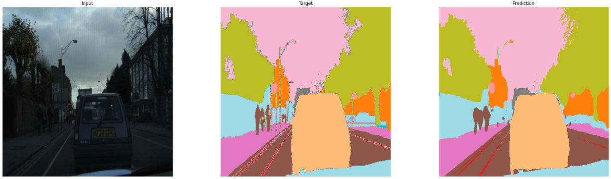

# Image Segmentation using UNet on Camvid dataset
[Colab Notebook](https://colab.research.google.com/github/prajwal-suresh13/camvid_segmentation/blob/master/segmentation.ipynb)

## Introduction
Image Segmentation is a method of dividing an image into subgroups. Each pixel of an image is assigned to a particular class. It has many applications in medical imaging,
self-driving cars etc

## Training and Results
UNet model is trained for 90 epochs. At the end of training, the training accuracy is 90.19% adn validation accuracy is 87.23%

The results are as follows:

## Data

CamVid dataset is used for training UNet model. The Cambridge-driving Labeled Video Database (CamVid) is collection of videos with object class semantic labels. 
It consists of over 700 per-pixel semantic segmentation images. Each pixel is associated to one of the 32 classes 

## Model Architecture & Loss Function

UNet is a U-Shaped encoder-decoder architecture. It consists of four enocder and four decoder blocks. Skip connections are added from encoder to decoder which helps to generate better 
semantic features

